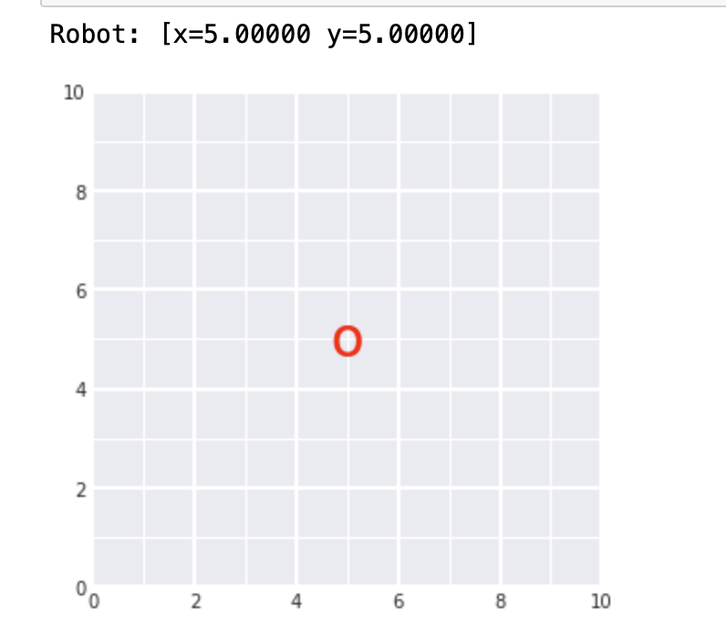
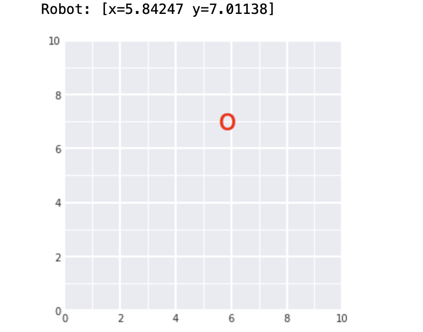
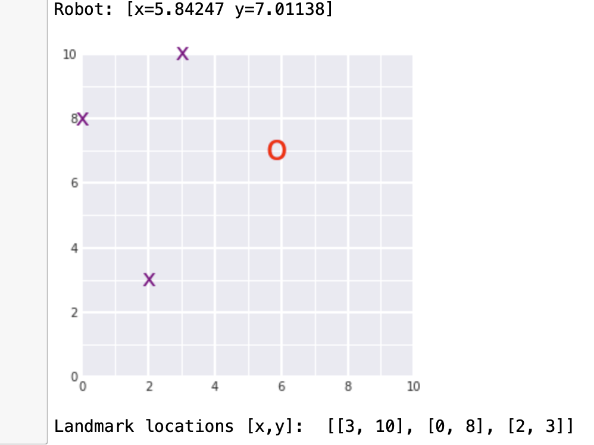
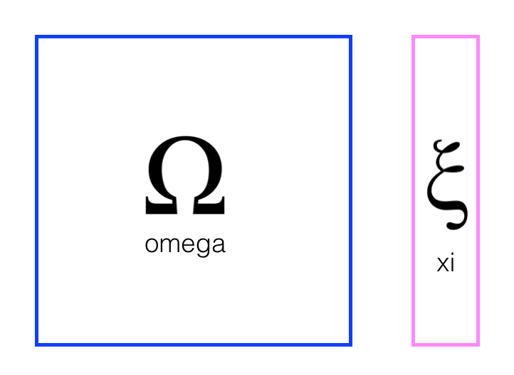
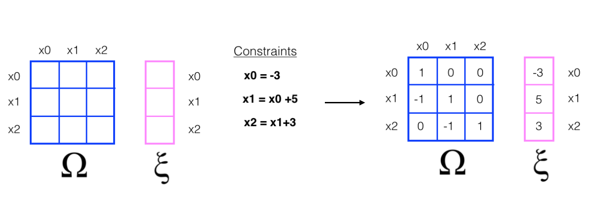
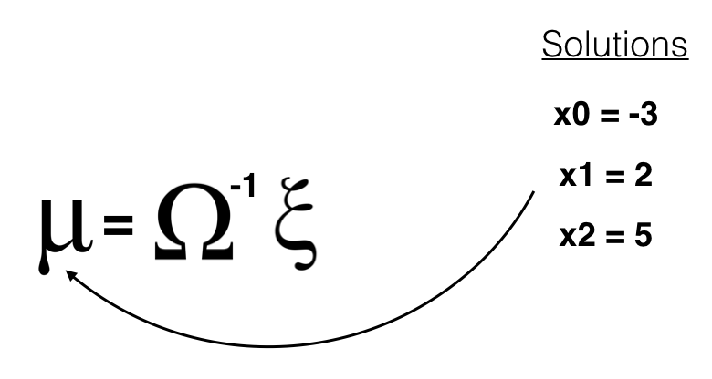
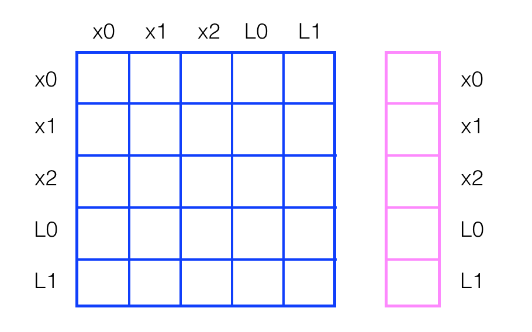
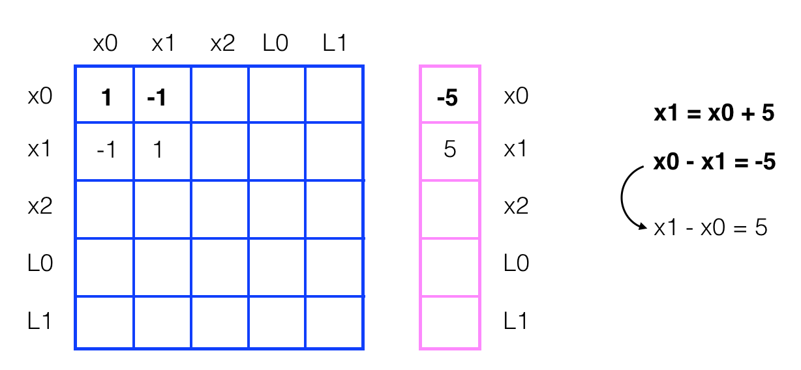
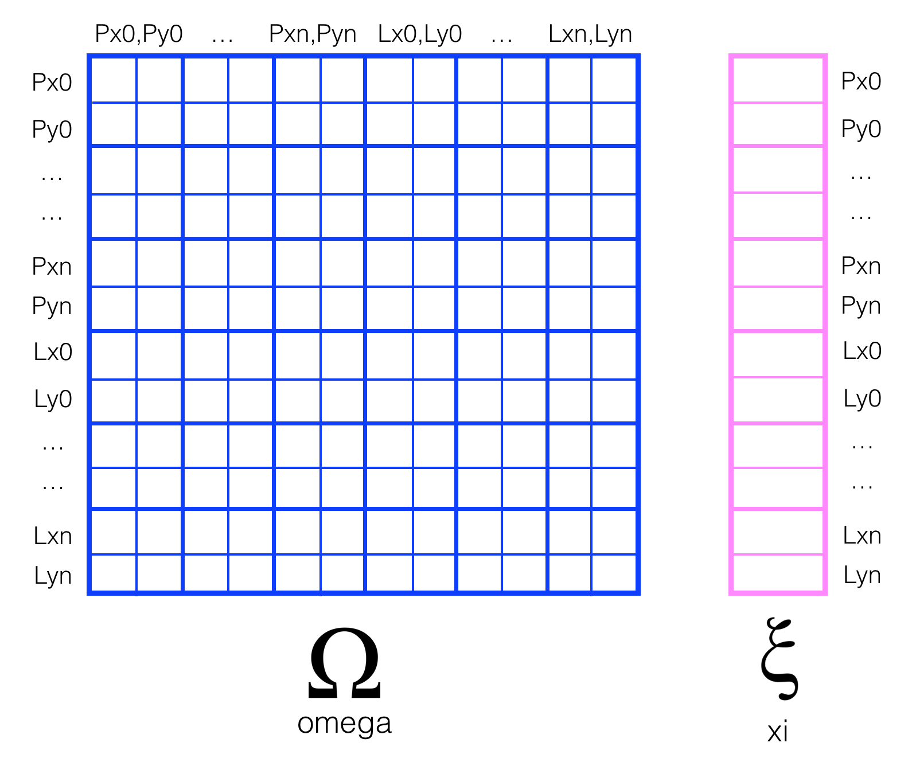

# SLAM_Robot_Tracking
Landmark Detection &amp; Robot Tracking 


# Project: Landmark Detection & Robot Tracking (SLAM)

## Project Overview

In this project, you'll implement SLAM (Simultaneous Localization and Mapping) for a 2 dimensional world! You’ll combine what you know about robot sensor measurements and movement to create a map of an environment from only sensor and motion data gathered by a robot, over time. SLAM gives you a way to track the location of a robot in the world in real-time and identify the locations of landmarks such as buildings, trees, rocks, and other world features. This is an active area of research in the fields of robotics and autonomous systems. 


*Below is an example of a 2D robot world with landmarks (purple x's) and the robot (a red 'o') located and found using only sensor and motion data collected by that robot. This is just one example for a 50x50 grid world; in your work you will likely generate a variety of these maps.*


Example of SLAM output (estimated final robot pose and landmark locations).


## Project Instructions

The project will be broken up into three Python notebooks; the first two are for exploration of provided code, and a review of SLAM architectures, **only Notebook 3 and the `robot_class.py` file will be graded**:

**Notebook 1** : Robot Moving and Sensing

**Notebook 2** : Omega and Xi, Constraints 

**Notebook 3** : Landmark Detection and Tracking 

You can find these notebooks in the Udacity workspace that appears in the concept titled **Project: Landmark Detection & Tracking**. This workspace provides a Jupyter notebook server directly in your browser. 

You can also choose to complete this project in your own local repository, and you can find all of the project files in this [GitHub repository](https://github.com/udacity/P3_Implement_SLAM). Note that while you are *allowed* to complete this project on your local computer, you are strongly encouraged to complete the project from the workspace.

## Evaluation

Your project will be reviewed by a Udacity reviewer against the Landmark Detection & Tracking project [rubric](https://review.udacity.com/#!/rubrics/1428/view). Review this rubric thoroughly, and self-evaluate your project before submission. All criteria found in the rubric must meet specifications for you to pass.

## Zip file submission

If you are submitting this project from a workspace or as a zip file, it is recommended that you follow the instructions in the final workspace notebook to compress your project files and make sure your submission is not too large. You are *only* graded on Notebook 3, and the file `robot_class.py`.

## Ready to submit your project?

Click on the "Submit Project" button and follow the instructions to submit!

# Robot Class

In this project, we'll be localizing a robot in a 2D grid world. The basis for simultaneous localization and mapping (SLAM) is to gather information from a robot's sensors and motions over time, and then use information about measurements and motion to re-construct a map of the world.

### Uncertainty

As you've learned, robot motion and sensors have some uncertainty associated with them. For example, imagine a car driving up hill and down hill; the speedometer reading will likely overestimate the speed of the car going up hill and underestimate the speed of the car going down hill because it cannot perfectly account for gravity. Similarly, we cannot perfectly predict the *motion* of a robot. A robot is likely to slightly overshoot or undershoot a target location.

In this notebook, we'll look at the `robot` class that is *partially* given to you for the upcoming SLAM notebook. First, we'll create a robot and move it around a 2D grid world. Then, **you'll be tasked with defining a `sense` function for this robot that allows it to sense landmarks in a given world**! It's important that you understand how this robot moves, senses, and how it keeps track of different landmarks that it sees in a 2D grid world, so that you can work with it's movement and sensor data.

Before we start analyzing robot motion, let's load in our resources and define the `robot`class. You can see that this class initializes the robot's position and adds measures of uncertainty for motion. You'll also see a `sense()` function which is not yet implemented, and you will learn more about that later in this notebook.

```python
from math import *
import random


### ------------------------------------- ###
# Below, is the robot class
#
# This robot lives in 2D, x-y space, and its motion is
# pointed in a random direction, initially.
# It moves in a straight line until it comes close to a wall 
# at which point it stops.
#
# For measurements, it  senses the x- and y-distance
# to landmarks. This is different from range and bearing as
# commonly studied in the literature, but this makes it much
# easier to implement the essentials of SLAM without
# cluttered math.
#
class robot:
    
    # --------
    # init:
    #   creates a robot with the specified parameters and initializes
    #   the location (self.x, self.y) to the center of the world
    #
    def __init__(self, world_size = 100.0, measurement_range = 30.0,
                 motion_noise = 1.0, measurement_noise = 1.0):
        self.measurement_noise = 0.0
        self.world_size = world_size
        self.measurement_range = measurement_range
        self.x = world_size / 2.0
        self.y = world_size / 2.0
        self.motion_noise = motion_noise
        self.measurement_noise = measurement_noise
        self.landmarks = []
        self.num_landmarks = 0
    
    
    # returns a positive, random float
    def rand(self):
        return random.random() * 2.0 - 1.0
    
    
    # --------
    # move: attempts to move robot by dx, dy. If outside world
    #       boundary, then the move does nothing and instead returns failure
    #
    def move(self, dx, dy):
        
        x = self.x + dx + self.rand() * self.motion_noise
        y = self.y + dy + self.rand() * self.motion_noise
        
        if x < 0.0 or x > self.world_size or y < 0.0 or y > self.world_size:
            return False
        else:
            self.x = x
            self.y = y
            return True


    # --------
    # sense: returns x- and y- distances to landmarks within visibility range
    #        because not all landmarks may be in this range, the list of measurements
    #        is of variable length. Set measurement_range to -1 if you want all
    #        landmarks to be visible at all times
    #
    
    ## TODO: paste your complete the sense function, here
    ## make sure the indentation of the code is correct
    def sense(self):
        ''' This function does not take in any parameters, instead it references internal variables
            (such as self.landamrks) to measure the distance between the robot and any landmarks
            that the robot can see (that are within its measurement range).
            This function returns a list of landmark indices, and the measured distances (dx, dy)
            between the robot's position and said landmarks.
            This function should account for measurement_noise and measurement_range.
            One item in the returned list should be in the form: [landmark_index, dx, dy].
            '''
           
        measurements = []
        self.measurement_range = -1
        for idx, l in enumerate(self.landmarks):
            dx = l[0]-self.x + self.rand() * self.measurement_noise
            dy = l[1]-self.y + self.rand() * self.measurement_noise
            if self.measurement_range == -1 or abs(dx) <= self.measurement_range and abs(dy) <= self.measurement_range:
                measurements.append([idx,dx,dy])
        
        

        ## 1. compute dx and dy, the distances between the robot and the landmark
        ## 2. account for measurement noise by *adding* a noise component to dx and dy
        ##    - The noise component should be a random value between [-1.0, 1.0)*measurement_noise
        ##    - Feel free to use the function self.rand() to help calculate this noise component
        ## 3. If either of the distances, dx or dy, fall outside of the internal var, measurement_range
        ##    then we cannot record them; if they do fall in the range, then add them to the measurements list
        ##    as list.append([index, dx, dy]), this format is important for data creation done later
        
        ## TODO: return the final, complete list of measurements
        return measurements


    # --------
    # make_landmarks:
    # make random landmarks located in the world
    #
    def make_landmarks(self, num_landmarks):
        self.landmarks = []
        for i in range(num_landmarks):
            self.landmarks.append([round(random.random() * self.world_size),
                                   round(random.random() * self.world_size)])
        self.num_landmarks = num_landmarks


    # called when print(robot) is called; prints the robot's location
    def __repr__(self):
        return 'Robot: [x=%.5f y=%.5f]'  % (self.x, self.y)


####### END robot class #######
```

## Define a world and a robot

Next, let's instantiate a robot object. As you can see in `__init__` above, the robot class takes in a number of parameters including a world size and some values that indicate the sensing and movement capabilities of the robot.

In the next example, we define a small 10x10 square world, a measurement range that is half that of the world and small values for motion and measurement noise. These values will typically be about 10 times larger, but we ust want to demonstrate this behavior on a small scale. You are also free to change these values and note what happens as your robot moves!

```python
world_size         = 10.0    # size of world (square)
measurement_range  = 5.0     # range at which we can sense landmarks
motion_noise       = 0.2      # noise in robot motion
measurement_noise  = 0.2      # noise in the measurements

# instantiate a robot, r
r = robot(world_size, measurement_range, motion_noise, measurement_noise)

# print out the location of r
print(r)
Robot: [x=5.00000 y=5.00000]
```

## Visualizing the World

In the given example, we can see/print out that the robot is in the middle of the 10x10 world at (x, y) = (5.0, 5.0), which is exactly what we expect!

However, it's kind of hard to imagine this robot in the center of a world, without visualizing the grid itself, and so in the next cell we provide a helper visualization function, `display_world`, that will display a grid world in a plot and draw a red `o` at the location of our robot, `r`. The details of how this function wors can be found in the `helpers.py` file in the home directory; you do not have to change anything in this `helpers.py` file.

```python
# import helper function
from helpers import display_world

# define figure size
plt.rcParams["figure.figsize"] = (5,5)

# call display_world and display the robot in it's grid world
print(r)
display_world(int(world_size), [r.x, r.y])
```



## Movement

Now you can really picture where the robot is in the world! Next, let's call the robot's `move`function. We'll ask it to move some distance `(dx, dy)` and we'll see that this motion is not perfect by the placement of our robot `o` and by the printed out position of `r`. 

Try changing the values of `dx` and `dy` and/or running this cell multiple times; see how the robot moves and how the uncertainty in robot motion accumulates over multiple movements.

**For a `dx` = 1, does the robot move \*exactly\* one spot to the right? What about `dx` = -1? What happens if you try to move the robot past the boundaries of the world?**

```
# choose values of dx and dy (negative works, too)
dx = 1
dy = 2
r.move(dx, dy)

# print out the exact location
print(r)

# display the world after movement, not that this is the same call as before
# the robot tracks its own movement
display_world(int(world_size), [r.x, r.y])
```



## Landmarks

Next, let's create landmarks, which are measurable features in the map. You can think of landmarks as things like notable buildings, or something smaller such as a tree, rock, or other feature.

The robot class has a function `make_landmarks` which randomly generates locations for the number of specified landmarks. Try changing `num_landmarks` or running this cell multiple times to see where these landmarks appear. We have to pass these locations as a third argument to the `display_world` function and the list of landmark locations is accessed similar to how we find the robot position `r.landmarks`. 

Each landmark is displayed as a purple `x` in the grid world, and we also print out the exact `[x, y]` locations of these landmarks at the end of this cell.

```python
# create any number of landmarks
num_landmarks = 3
r.make_landmarks(num_landmarks)

# print out our robot's exact location
print(r)

# display the world including these landmarks
display_world(int(world_size), [r.x, r.y], r.landmarks)

# print the locations of the landmarks
print('Landmark locations [x,y]: ', r.landmarks)
```



## Sense

Once we have some landmarks to sense, we need to be able to tell our robot to *try* to sense how far they are away from it. It will be up t you to code the `sense` function in our robot class.

The `sense` function uses only internal class parameters and returns a list of the the measured/sensed x and y distances to the landmarks it senses within the specified `measurement_range`. 

### TODO: Implement the `sense` function

Follow the `##TODO's` in the class code above to complete the `sense` function for the robot class. Once you have tested out your code, please **copy your complete `sense` code to the `robot_class.py` file in the home directory**. By placing this complete code in the `robot_class` Python file, we will be able to refernce this class in a later notebook.

The measurements have the format, `[i, dx, dy]` where `i` is the landmark index (0, 1, 2, ...) and `dx` and `dy` are the measured distance between the robot's location (x, y) and the landmark's location (x, y). This distance will not be perfect since our sense function has some associated `measurement noise`.

In the example in the following cell, we have a given our robot a range of `5.0` so any landmarks that are within that range of our robot's location, should appear in a list of measurements. Not all landmarks are guaranteed to be in our visibility range, so this list will be variable in length.

*Note: the robot's location is often called the **pose** or `[Pxi, Pyi]` and the landmark locations are often written as `[Lxi, Lyi]`. You'll see this notation in the next notebook.*


```
# try to sense any surrounding landmarks
measurements = r.sense()

# this will print out an empty list if `sense` has not been implemented
print(measurements)
[]
```

**Refer back to the grid map above. Do these measurements make sense to you? Are all the landmarks captured in this list (why/why not)?**

## Data

#### Putting it all together

To perform SLAM, we'll collect a series of robot sensor measurements and motions, in that order, over a defined period of time. Then we'll use only this data to re-construct the map of the world with the robot and landmar locations. You can think of SLAM as peforming what we've done in this notebook, only backwards. Instead of defining a world and robot and creating movement and sensor data, it will be up to you to use movement and sensor measurements to reconstruct the world!

In the next notebook, you'll see this list of movements and measurements (which you'll use to re-construct the world) listed in a structure called `data`. This is an array that holds sensor measurements and movements in a specific order, which will be useful to call upon when you have to extract this data and form constraint matrices and vectors.

`data` is constructed over a series of time steps as follows:

```
data = []

# after a robot first senses, then moves (one time step)
# that data is appended like so:
data.append([measurements, [dx, dy]])

# for our example movement and measurement
print(data)
[[[], [1, 2]]]
# in this example, we have only created one time step (0)
time_step = 0

# so you can access robot measurements:
print('Measurements: ', data[time_step][0])

# and its motion for a given time step:
print('Motion: ', data[time_step][1])
Measurements:  []
Motion:  [1, 2]
```

### Final robot class

Before moving on to the last notebook in this series, please make sure that you have copied your final, completed `sense` function into the `robot_class.py` file in the home directory. We will be using this file in the final implementation of slam!

## Omega and Xi

To implement Graph SLAM, a matrix and a vector (omega and xi, respectively) are introduced. The matrix is square and labelled with all the robot poses (xi) and all the landmarks (Li). Every time you make an observation, for example, as you move between two poses by some distance `dx` and can relate those two positions, you can represent this as a numerical relationship in these matrices.

It's easiest to see how these work in an example. Below you can see a matrix representation of omega and a vector representation of xi.



Next, let's look at a simple example that relates 3 poses to one another. 

- When you start out in the world most of these values are zeros or contain only values from the initial robot position

- In this example, you have been given constraints, which relate these poses to one another

- Constraints translate into matrix values

  

  If you have ever solved linear systems of equations before, this may look familiar, and if not, let's keep going!

  ### Solving for x

  To "solve" for all these x values, we can use linear algebra; all the values of x are in the vector `mu` which can be calculated as a product of the inverse of omega times xi.



**You can confirm this result for yourself by executing the math in the cell below.**

```python
import numpy as np

# define omega and xi as in the example
omega = np.array([[1,0,0],
                  [-1,1,0],
                  [0,-1,1]])

xi = np.array([[-3],
               [5],
               [3]])

# calculate the inverse of omega
omega_inv = np.linalg.inv(np.matrix(omega))

# calculate the solution, mu
mu = omega_inv*xi

# print out the values of mu (x0, x1, x2)
print(mu)
[[-3.]
 [ 2.]
 [ 5.]]
```

## Motion Constraints and Landmarks

In the last example, the constraint equations, relating one pose to another were given to you. In this next example, let's look at how motion (and similarly, sensor measurements) can be used to create constraints and fill up the constraint matrices, omega and xi. Let's start with empty/zero matrices.



This example also includes relationships between poses and landmarks. Say we move from x0 to x1 with a displacement `dx` of 5. Then we have created a motion constraint that relates x0 to x1, and we can start to fill up these matrices.



In fact, the one constraint equation can be written in two ways. So, the motion constraint that relates x0 and x1 by the motion of 5 has affected the matrix, adding values for *all* elements that correspond to x0 and x1.

### 2D case

In these examples, we've been showing you change in only one dimension, the x-dimension. In the project, it will be up to you to represent x and y positional values in omega and xi. One solution could be to create an omega and xi that are 2x larger that the number of robot poses (that will be generated over a series of time steps) and the number of landmarks, so that they can hold both x and y values for poses and landmark locations. I might suggest drawing out a rough solution to graph slam as you read the instructions in the next notebook; that always helps me organize my thoughts. Good luck!

